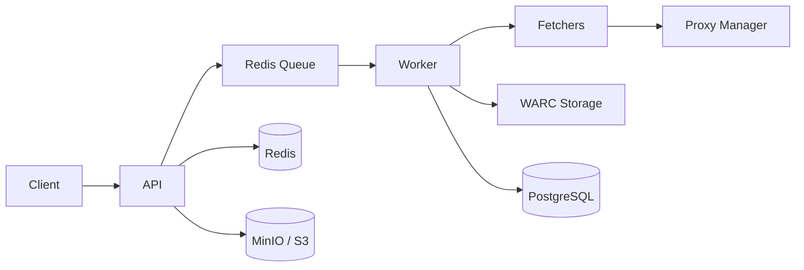

# Crawler API

Multi-tenant web scraping platform with per-domain policies, proxy pool management, rate limiting, WARC archival, and async job processing.

## Architecture



- **API** (FastAPI): REST endpoints for job submission, archive retrieval, usage stats, admin.
- **Worker** (arq): Async fetch tasks with policy resolution, proxy selection, WARC archival, callbacks.
- **PostgreSQL**: Tenants, applications, API keys, domain policies, proxy pools, usage counters, WARC index, partitioned request logs.
- **Redis**: Rate limiter (Lua sliding-window), job queue, circuit breaker state, sticky sessions.
- **MinIO/S3**: WARC file storage with byte-range reads for random-access retrieval.
- **Prometheus**: 8 metrics exposed at `/metrics` for latency, block rate, queue depth, proxy health, WARC bytes, costs.

## Getting Started

Prerequisites: Docker, docker-compose, Python 3.12.

```bash
cp .env.example .env
# Fill required fields: DATABASE_URL, REDIS_URL, API_KEYS_RAW
docker compose up -d
./scripts/verify.sh   # Stage 13: runs full verification
curl http://localhost:8000/healthz
```

## Verified State

| Field | Value |
|---|---|
| Tag | `v0.1.0` |
| Date | 2026-07-29 |
| Migration head | `a7c55bf575f3` |
| Tests | 86 passed, 0 failed |
| verify.sh | OK (second run; cold-start archive timing documented in ADR-013) |

**Quick reproduction:**
```bash
docker compose build --no-cache
docker compose up -d
docker compose exec api alembic upgrade head
docker compose exec api python3 scripts/bootstrap_dev.py  # prints API key
./scripts/verify.sh
```

For operations, see [docs/runbook.md](docs/runbook.md).

## Documentation

| Document | Purpose |
|---|---|
| [`docs/PROJECT-HISTORY.md`](docs/PROJECT-HISTORY.md) | 15-stage rebuild narrative, architecture, bugs found, deferred items |
| [`docs/AI-ASSISTED-DEVELOPMENT.md`](docs/AI-ASSISTED-DEVELOPMENT.md) | Working method, agent failure modes, transferable rules |
| [`docs/runbook.md`](docs/runbook.md) | Operations: proxy sync cron, DLQ inspection, browser mode |
| [`docs/decisions/`](docs/decisions/) | Architecture Decision Records (ADR-001 through ADR-015) |
| [`docs/SESSION-SUMMARY.md`](docs/SESSION-SUMMARY.md) | Quick reference pointer |

## API Examples

```bash
# Submit async fetch
curl -X POST http://localhost:8000/v1/fetch \
  -H "X-API-Key: crw_live_..." \
  -H "Content-Type: application/json" \
  -d '{"url":"https://example.com","mode":"static"}'

# Poll result
curl http://localhost:8000/v1/jobs/{job_id} -H "X-API-Key: crw_live_..."

# Archive search
curl "http://localhost:8000/v1/archive?url=https://example.com&from=2026-01-01" \
  -H "X-API-Key: crw_live_..."

# Usage stats
curl http://localhost:8000/v1/usage -H "X-API-Key: crw_live_..."

# Admin: create domain policy
curl -X POST http://localhost:8000/v1/admin/domain-policies \
  -H "X-API-Key: crw_live_..." \
  -d '{"domain":"example.com","engine":"playwright","rate_limit_rps":2.0}'
```

## Metrics

| Metric | Description |
|---|---|
| crawler_block_rate_total | Blocked fetches by domain/engine/reason |
| crawler_request_latency_ms | Request/worker latency histogram |
| crawler_queue_depth | Async job queue depth |
| crawler_proxy_health_score | Current proxy health per proxy |
| crawler_warc_bytes_total | WARC bytes written (response/revisit) |
| crawler_dedup_ratio | Revisit ratio over total records |
| crawler_proxy_cost_eur_total | Estimated proxy traffic cost |
| crawler_rate_limit_hits_total | Rate limit denials by layer |

## Scaling & Failure Modes

**What breaks at 100x:**
- Single Redis bottleneck for rate limiting + queue + circuit breaker.
- DB writes per request (proxy health, usage counters) — batch writes needed.
- WARC 1 GB in-memory buffer — frequent rotation and S3 uploads.
- Browser-per-fetch (Playwright) — 100 concurrent browsers exhaust 8 GB RAM.

**Mitigations at 10x:** Redis Cluster or separate Redis instances. Batch proxy health writes. Increase WARC rotation threshold.

**Mitigations at 100x:** PostgreSQL read replicas. Browser pool with pre-warmed instances. Distributed queue (move arq to multi-worker with Redis Cluster).

## Legal & Ethics

- Respect `robots.txt` when `respect_robots=True` in domain policy.
- Comply with target site Terms of Service.
- Avoid scraping personal data without consent or legitimate interest.
- Honor takedown and removal requests.
- WARC archives and logs may contain sensitive third-party content; handle accordingly.

## AI Usage

- AI-assisted code generation (Claude Code) for architecture design, ADRs, and implementation.
- No automated in-production decision-making beyond rate limiting and proxy selection.
- All ADRs and architectural decisions must be reviewed by a human operator before production deployment.
