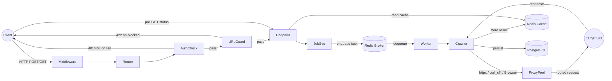

# Stage 0 — Architecture & Requirement Audit

Generated: 2026-07-27 | Branch: step-1 | Scope: read-only, every file in `app/`, `Dockerfile`, `docker-compose.yml`, `requirements.txt`, `.env.example`.

---

## Architecture Map

### Request Lifecycle

1. **Client** sends HTTP request to FastAPI (uvicorn).
2. **Middleware** layer applies CORS (allow-all) and `CorrelationIdMiddleware` (pass-through or generate `X-Correlation-ID`).
3. **Router** (`app.api.v1.router`) dispatches to the matching endpoint handler.
4. **AuthCheck** (`verify_api_key` dependency) validates the `X-API-Key` header against a flat key list from config. Returns 401/403 on failure.
5. **URLGuard** validates the target URL: scheme (`http/https` only), port (`80/443/8080/8443`), DNS resolution against private/reserved IP ranges (SSRF), and redirect chain policy. Returns 422 on blocked URLs.
6. **Endpoint** handler (jobs/batches/auth/projects/proxy) forwards to the appropriate service.
7. **JobSvc** / **BatchSvc** wraps arguments into a Celery task and enqueues it to **Redis broker**.
8. **Celery worker** (gevent pool, concurrency=50) picks up the task and invokes the **Crawler** engine.
9. **Crawler** selects mode: `static` (httpx with per-hop url_guard), `stealth` (curl_cffi with TLS impersonation), `browser` (Playwright), or `camoufox` (anti-detect Firefox). Routes through **ProxyPool** if enabled.
10. Result is stored in **Redis Cache** (TTL 24h) and optionally persisted to **PostgreSQL** (dual-write; DB save path exists but is not called from the worker task).
11. **Client** polls `GET /jobs/{id}/status` and `GET /jobs/{id}/result` which read from Redis cache.

### Module Responsibilities

| Module | Responsibility |
|---|---|
| `app/main.py` | FastAPI app creation, CORS, middleware wiring, lifespan (startup proxy sync), `/health` endpoint |
| `app/api/v1/router.py` | Aggregates all v1 endpoint routers into a single `APIRouter` |
| `app/api/v1/endpoints/auth.py` | Universal login + manual cookie injection + session status/delete via site adapters |
| `app/api/v1/endpoints/jobs.py` | Single-URL crawl creation with SSRF guard, job status polling, result retrieval |
| `app/api/v1/endpoints/batches.py` | Batch crawl creation (multiple URLs), batch status/results aggregation |
| `app/api/v1/endpoints/projects.py` | Project CRUD with API key generation (in-memory store) |
| `app/api/v1/endpoints/proxy.py` | Proxy pool stats, reset health, manual Webshare sync trigger |
| `app/core/config.py` | All runtime settings via `pydantic-settings` from env vars / `.env` file |
| `app/core/db.py` | SQLAlchemy 2.x async engine, session factory, declarative `Base`, `create_tables()` auto-DDL |
| `app/core/security.py` | API key header authentication with constant-time comparison |
| `app/core/ssrf_guard.py` | Blocking DNS-based IP validation against private/reserved/metadata ranges |
| `app/core/url_guard.py` | Outbound URL policy: scheme, port, redirect chain, body-size caps; async + sync DNS |
| `app/core/logging_config.py` | JSON-structured logging with credential redaction (proxy lines, proxy URLs, API keys) |
| `app/middleware/correlation_id.py` | X-Correlation-ID pass-through or generation on every request/response |
| `app/models/project.py` | `Project` ORM model (id, name, api_key, is_active, created_at) |
| `app/models/crawl_result.py` | `CrawlResult` ORM model (job_id, url, status, body, markdown, extracted, headers, errors) |
| `app/schemas/requests.py` | Pydantic v2 request models: `CrawlRequest`, `BatchCrawlRequest`, `ProjectCreateRequest` |
| `app/schemas/responses.py` | Pydantic v2 response models: `JobResponse`, `CrawlResult`, `BatchResponse`, `ProjectResponse`, `TaskState` enum |
| `app/services/crawler.py` | `Crawler` (httpx sync), `SmartProxyPool`, `ProxyRateLimiter`, HTML helpers, ban detection |
| `app/services/stealth_crawler.py` | `StealthCrawler` (curl_cffi), `crawl_camoufox` (anti-detect Firefox), `crawl_playwright_stealth` |
| `app/services/geo_proxy_pool.py` | `GeoProxyPool` extends `SmartProxyPool` with per-country proxy selection and geo-stats |
| `app/services/proxy_singleton.py` | Lazy-init global `GeoProxyPool` singleton, reset on Webshare sync |
| `app/services/job_service.py` | Celery task submission, status polling, result deserialization |
| `app/services/batch_service.py` | Batch creation (N tasks), progress aggregation, result collection |
| `app/services/storage.py` | Dual-write service: Redis TTL cache (used) + PostgreSQL async persistence (defined but uncalled) |
| `app/services/events.py` | Redis Streams event publishing for crawl lifecycle events |
| `app/services/webshare_sync.py` | Webshare API v2 proxy list fetcher + file writer |
| `app/worker/celery_app.py` | Celery app config: Redis broker, JSON serialization, beat schedule (periodic proxy sync) |
| `app/worker/tasks/crawl.py` | Main crawl task — dispatches by mode, encodes body (base64+gzip), saves result, publishes event |
| `app/worker/tasks/sync.py` | Periodic Celery Beat task — re-syncs Webshare proxy list and reloads pool singleton |

### Async Strategy

- **Request handlers**: `async def` FastAPI endpoints — non-blocking in the API process.
- **Crawling**: Sync Celery tasks (`crawl_page`, `task_site_login`) — blocking I/O inside the worker is expected.
- **Bridge**: `asyncio.run()` wraps async browser/camoufox crawl functions inside sync Celery tasks. This creates a fresh event loop per task invocation.
- **Worker pool**: gevent (greenlet-based concurrency, 50 workers). Interaction between `asyncio.run()` (which creates a real asyncio event loop) and gevent monkey-patching is untested and may deadlock under load.
- **Connection pools**: SQLAlchemy pool_size=10, max_overflow=20. Redis connections: per-call `redis.Redis.from_url()` (no shared connection pool).
- **Blocking calls in async path**: `ssrf_guard.validate_url_against_ssrf` uses `socket.getaddrinfo` (sync DNS) — called from the async batch endpoint. The `/health` endpoint creates a sync `redis.Redis` client in an async handler. Both stall the event loop.

---

## Inventory Against Requirements

| Requirement | Status | Notes |
|---|---|---|
| Multi-tenancy | ⚠️ partial | `Project` ORM model exists with per-project API keys, but project endpoints use in-memory dict (not DB) and `verify_api_key` checks a flat config list, not per-project keys. `project_id` is stored as metadata only — no row-level isolation. |
| API-key security | ⚠️ partial | X-API-Key header auth with constant-time comparison works for a flat key list. No per-project key validation, no key rotation, no key revocation, no rate-limit-per-key. |
| Per-domain policies | ❌ missing | No per-domain retry, delay, proxy selection, or policy resolution exists. `detect_country_from_url` auto-detects country from TLD but that is the only domain-aware behavior. |
| Proxy pools | ✅ implemented | `SmartProxyPool` + `GeoProxyPool` with health scoring, success-rate tracking, per-proxy rate limiting via Redis, auto-block detection, Webshare sync, and country-based selection. |
| 4-layer rate limiter | ❌ missing | Only per-proxy cooldown exists (`ProxyRateLimiter`). No per-domain, per-tenant, or global API-level rate limiting. No token bucket or sliding window. |
| WARC archive | ❌ missing | `warcio` is listed in CLAUDE.md stack but not in `requirements.txt`. No WARC writer, CDXJ index, or archival storage code exists. |
| Async job queue | ✅ implemented | Celery with Redis broker, JSON serialization, task ack-late, beat scheduler for periodic proxy sync. Dedicated `crawler` queue. |
| Observability | ⚠️ partial | JSON structured logging with credential redaction and correlation IDs works well. Redis Streams events published for crawl lifecycle. No Prometheus metrics endpoint, no OpenTelemetry tracing despite both being in CLAUDE.md stack. |
| Alembic migrations | ❌ missing | No `alembic/` directory, no `alembic.ini`, no migration files. Tables are created via `Base.metadata.create_all()` in `db.create_tables()` — auto-DDL only, no versioning. |
| Test suite | ⚠️ partial | 15 tests across 3 files cover: URL guard (static checks), logging redaction, and smoke/import checks. Good coverage for those areas. No integration tests for endpoints, services, Celery tasks, or proxy pool. testcontainers fixtures exist but no test uses them. |
| CI/CD pipeline | ✅ implemented | GitHub Actions: lint (ruff + mypy), test (pytest + coverage), build (Docker). Concurrency-grouped, cache-enabled. |
| Terraform infra | ❌ missing | No `infra/terraform/` directory exists. |

---

## Defects by Severity

### CRITICAL

- **[CRITICAL]** docker-compose.yml:7-8 — Hardcoded PostgreSQL credentials (`POSTGRES_USER=crawler`, `POSTGRES_PASSWORD=crawler`) committed to version control.
- **[CRITICAL]** docker-compose.yml:40 — Database connection string with credentials `crawler:crawler` hardcoded in the `api` service environment.
- **[CRITICAL]** docker-compose.yml:60 — Database connection string with credentials `crawler:crawler` hardcoded in the `worker` service environment.
- **[CRITICAL]** app/main.py:62 — CORS `allow_origins=["*"]` combined with `allow_credentials=True`. Browsers reject this combination (CORS specification); if bypassed it exposes authenticated responses to any origin. `allow_origins` must be explicit when credentials are enabled.
- **[CRITICAL]** app/schemas/requests.py:1 — `BatchCrawlRequest` and `ProjectCreateRequest` are imported by `batches.py` and `projects.py` but neither class is defined in the schemas file (only `CrawlRequest` exists). This causes `ImportError` at app startup, making both the `/batches` and `/projects` routers unloadable.

### HIGH

- **[HIGH]** app/api/v1/endpoints/projects.py:13 — `create_project` endpoint has NO authentication dependency. Any unauthenticated caller can create projects and obtain API keys.
- **[HIGH]** app/api/v1/endpoints/projects.py:29 — `list_projects` endpoint has NO authentication dependency. Any unauthenticated caller can enumerate all projects and their API keys.
- **[HIGH]** app/api/v1/endpoints/batches.py:19 — Uses `ssrf_guard.validate_url_against_ssrf` (blocking `socket.getaddrinfo`) inside an async endpoint handler, stalling the event loop for the DNS timeout duration.
- **[HIGH]** app/worker/tasks/crawl.py:74 — `asyncio.run(crawl_playwright_stealth(...))` inside a Celery task running under gevent pool. `asyncio.run()` creates a new event loop; gevent's monkey-patched `socket` and `threading` modules may conflict with the real asyncio event loop, causing silent hangs or `RuntimeError`.
- **[HIGH]** app/worker/tasks/crawl.py:85 — Same `asyncio.run(crawl_camoufox(...))` issue as line 74.
- **[HIGH]** app/main.py:82 — Sync `redis.Redis.from_url(...)` with `r.ping()` is a blocking I/O call inside an async handler (`/health`). Stalls the event loop for the socket connect timeout (2s).
- **[HIGH]** app/services/stealth_crawler.py:82 — `allow_redirects=True` in curl_cffi requests without per-hop URL validation. A redirect from a public URL to `http://169.254.169.254/` would be followed without SSRF check, bypassing the url_guard protections that the httpx `Crawler` enforces on every hop.

### MEDIUM

- **[MEDIUM]** app/core/config.py:27 — Default `database_url` contains hardcoded credentials (`crawler:crawler`). While overridable via env, the default value is committed.
- **[MEDIUM]** app/services/stealth_crawler.py:141 — Hardcoded domain `".shopee.sg"` in cookie injection for `crawl_camoufox`. The Shopee adapter was deleted in commit `e3da2a0` but this residual hardcoding remains, which would inject cookies with wrong domain for any non-Shopee site.
- **[MEDIUM]** app/services/storage.py:58 — `save_result_to_db` is defined but never called from any code path. All crawl results are written to Redis only; PostgreSQL persistence is dead code.
- **[MEDIUM]** app/worker/tasks/crawl.py:97-102 — Task raises `RuntimeError` after calling `storage.save_job_result(job_id, error_result)`. Combined with `acks_late=True`, this causes Celery to re-deliver the task, resulting in duplicate crawl attempts for the same job (the first one already stored an error result).
- **[MEDIUM]** app/services/crawler.py:339 — Accesses private httpx attribute `res._content`. This relies on httpx internals and will break on httpx upgrades.
- **[MEDIUM]** app/core/ssrf_guard.py:83 — `socket.getaddrinfo` is a blocking call. While `url_guard.py` provides an async alternative (`validate_url_async`), the batches endpoint still uses the blocking `ssrf_guard` path directly.

### LOW

- **[LOW]** Dockerfile:1 — Base image is `python:3.11-slim` but CLAUDE.md convention states Python 3.12. CI also uses 3.11 — no runtime issue but documentation drift.
- **[LOW]** app/services/crawler.py:441 — `crawl_browser` is a standalone browser crawler using vanilla Playwright, functionally superseded by `crawl_playwright_stealth` in `stealth_crawler.py`. Dead code.
- **[LOW]** app/core/logging_config.py:23 — `_API_KEY` regex pattern references `crw_live_` / `crw_test_` key format "introduced in STEP 6" but no such key format exists yet in the codebase.
- **[LOW]** app/api/v1/endpoints/projects.py:10 — In-memory `_projects` dict is not thread-safe (no lock) and not shared across API worker processes. Multiple workers would have independent project stores.
- **[LOW]** app/models/project.py:11 — `Project.id` default uses `secrets.token_hex(8)` as a lambda default. SQLAlchemy calls the default once at class definition time (not per-row) when used as `default=callable`, but the lambda wrapping saves it. However, the `created_at` column uses the same pattern and both work correctly — the lambda ensures per-row evaluation.

---

## Architectural Change Proposals

### Proposal 1: Replace in-memory project store with DB-backed multi-tenancy

**Problem:** Project CRUD uses an in-memory dict with no persistence, no auth, and no cross-worker visibility, making the multi-tenancy claim unsupported.

**Solution:** Move project storage to the `projects` PostgreSQL table (model already exists), add `verify_api_key` dependency to project endpoints, and extend auth to resolve API keys against the database instead of a flat config list.

**Cost:** ~4 dev hours. No operational cost delta (same DB).

**Trade-off:** Slightly higher latency on auth (one DB query per request) — mitigatable with a short-lived Redis cache on validated keys.

### Proposal 2: Add async DNS resolution and eliminate event-loop blocking

**Problem:** `socket.getaddrinfo` (sync) is called from async FastAPI handlers and `asyncio.run()` is used inside gevent-based Celery workers, both risking event-loop stalls in the API and deadlocks in the worker.

**Solution:** Use `asyncio.get_running_loop().getaddrinfo()` (already implemented in `url_guard.validate_url_async`) for all API-path validations, and replace `asyncio.run()` in workers with a thread-pool executor or switch the worker pool from gevent to prefork.

**Cost:** ~3 dev hours. Slightly higher CPU (prefork uses more memory per worker).

**Trade-off:** Prefork pool consumes ~50MB×N workers vs gevent's ~50MB total. Acceptable for the stated EUR 20/month cloud budget at modest concurrency.

### Proposal 3: Implement Alembic migrations instead of auto-DDL

**Problem:** `Base.metadata.create_all()` provides no versioning, no downgrade path, and cannot handle schema changes after initial deployment without manual intervention.

**Solution:** Initialize Alembic with `alembic init`, generate an initial migration from the current model state, and replace the `create_tables()` call with `alembic upgrade head` at startup.

**Cost:** ~2 dev hours. No operational cost delta.

**Trade-off:** Adds one CLI command (`alembic revision --autogenerate`) to the developer workflow when changing models. The safety benefit of versioned, reviewable migrations outweighs this friction for any project with a database.

---

## Risk Register

| Risk | Likelihood | Impact | Mitigation |
|---|---|---|---|
| Proxy IPs blacklisted by target sites (Cloudflare, Akamai, DataDome) | High | High — crawl success rate drops to zero for protected targets | Multi-tier crawler fleet (static → stealth → camoufox); automated proxy rotation and health scoring; Webshare auto-refresh every 6h |
| DNS rebinding attack between URL validation and outbound request (TOCTOU) | Medium | Critical — SSRF to internal services despite validation | Resolve once, connect to the resolved IP directly instead of the hostname; enforce short TTL on DNS cache |
| Celery task re-delivery from `acks_late=True` + exception after result write | Medium | Medium — duplicate crawl requests waste proxy bandwidth and produce duplicate DB rows | Set task to `acks_late=False` for idempotent crawls, or add idempotency key check before crawling |
| Credential leak via log messages (proxy URLs with user:pass) | Medium | High — exposed proxy credentials compromise paid proxy accounts | Existing `RedactionFilter` covers known patterns; add pre-commit hook that scans for unreviewed proxy-line log calls |
| Unauthenticated project creation enabling API key generation by anyone | High | Medium — unauthorized users can create projects and abuse the crawling infrastructure | Add `Depends(verify_api_key)` to all project endpoints immediately |
| Event-loop blocking under concurrent batch submissions (sync DNS per URL) | High | Medium — API becomes unresponsive during batch validation of many URLs | Replace `ssrf_guard.validate_url_against_ssrf` with `url_guard.validate_url_async` in batches endpoint |
| Stale proxy list between Webshare syncs (default 6h interval) | Medium | Medium — up to 6h window where dead proxies cause crawl failures | Reduce sync interval; add health-check decay so unresponsive proxies are quarantined faster |
| Gevent + asyncio.run() deadlock in Celery worker for browser/camoufox modes | Medium | High — all browser-mode crawl jobs hang indefinitely | Switch worker pool to `prefork` and use `asyncio.run()` per child, or use `threading` pool for browser tasks |
